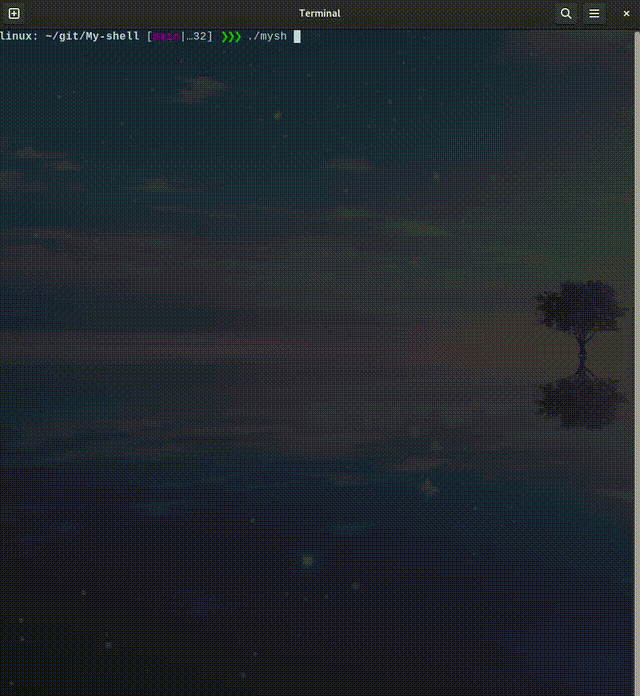

<h1 align="center">💻 MySH — Custom Terminal Shell</h1>

<p align="center">
  <a href="#EN">🇬🇧 English</a> • <a href="#FR">🇫🇷 Français</a>
</p>

<p align="center">
  
  
  
</p>

---

### 🎬 Demo

<div align="center">
  
</div>

---

### 🗂️ Project Structure

```
.
├── assets/
├── include/
├── src/
└── Makefile
```

---

### 🛠️ Build & Run

<p align="center">

| Step / Étape                                         | Command / Commande       | Description                                                                                                           |
| ---------------------------------------------------- | ------------------------ | --------------------------------------------------------------------------------------------------------------------- |
| 🔹 Compile the project / Compiler le projet          | <code>make</code>        | Compiles all sources and generates `mysh` executable / Compile tous les fichiers source et génère l’exécutable `mysh` |
| 🧹 Clean object files / Nettoyer les fichiers objets | <code>make clean</code>  | Removes temporary files (`*.o`) / Supprime les fichiers temporaires (`*.o`)                                           |
| ❌ Remove everything / Supprimer tout                 | <code>make fclean</code> | Removes object files and executable / Supprime les fichiers objets et l’exécutable                                    |
| 🔄 Recompile / Recompiler                            | <code>make re</code>     | Cleans then compiles again / Nettoie puis compile à nouveau le projet                                                 |
| ▶️ Run the shell / Lancer le shell                   | <code>./mysh</code>      | Starts the custom terminal shell / Lance le shell personnalisé                                                        |

</p>

---

## 🇬🇧 English <a id="EN"></a>

### 🧠 Overview

**MySH** is a custom terminal shell written in **C**, designed to mimic complex shells like **zsh**.
It supports built-in commands, piping, redirections, and advanced terminal functionalities.

---

### 🛠️ Features

* Built-in commands (e.g., `cd`, `exit`, `echo`)
* Command execution with arguments
* Pipes and redirections
* Background job execution
* Environment variable handling
* Signal handling (Ctrl+C, Ctrl+Z)
* Fully interactive terminal shell

---

### ⚙️ Usage

```bash
# Compile
make

# Run the shell
./mysh
```

---

### ⬇️ Download (precompiled version)

<p align="center">
🔹 <strong>Latest ready-to-use version:</strong><br>
<a href="https://github.com/USERNAME/mysh/releases/download/latest/mysh">👉 Download MySH (latest release)</a><br>
<em>Precompiled executable — ready to run!</em>
</p>

<p align="center">
Or clone the project:<br>
<code>git clone git@github.com:USERNAME/mysh.git</code>
</p>

---

### 🧪 CI/CD Workflow

Each push on the `main` branch:

<p align="center">
🔨 Automatically compiles the project <br>
🚀 Publishes the binary to the “latest” release <br>
*(see <code>.github/workflows/build.yml</code>)*
</p>

---

## 🇫🇷 Français <a id="FR"></a>

### 🧠 Présentation

**MySH** est un shell terminal personnalisé codé en **C**, reproduisant des fonctionnalités avancées similaires à **zsh**.
Il gère les commandes intégrées, les pipes, les redirections et les fonctionnalités terminal interactives.

---

### 🛠️ Fonctionnalités

* Commandes intégrées (`cd`, `exit`, `echo`, …)
* Exécution de commandes avec arguments
* Pipes et redirections
* Exécution de tâches en arrière-plan
* Gestion des variables d’environnement
* Gestion des signaux (Ctrl+C, Ctrl+Z)
* Shell interactif complet

---

### ⚙️ Utilisation

```bash
# Compiler
make

# Lancer le shell
./mysh
```

---

### ⬇️ Téléchargement (version compilée)

<p align="center">
🔹 <strong>Dernière version prête à l’emploi :</strong><br>
<a href="https://github.com/USERNAME/mysh/releases/download/latest/mysh">👉 Télécharger MySH (release latest)</a><br>
<em>Exécutable déjà compilé — prêt à utiliser !</em>
</p>

<p align="center">
Ou cloner le dépôt :<br>
<code>git clone git@github.com:USERNAME/mysh.git</code>
</p>

---

### 🧪 Workflow CI/CD

Chaque push sur la branche <code>main</code> :

<p align="center">
🔨 Compile automatiquement le projet <br>
🚀 Publie le binaire dans la release “latest” <br>
🧩 Défini dans <code>.github/workflows/build.yml</code>
</p>
